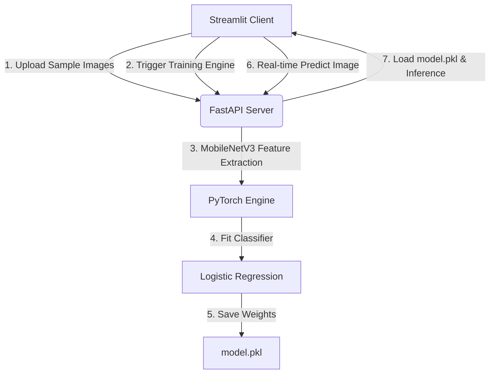

# Decoupled Teachable Machine 🚀
### A Step-by-Step Decoupled AI Transfer Learning Web Suite

Welcome to the **Teachable Machine Pro** clone! This project replicates the official Google Teachable Machine interface but implements a **completely decoupled, professional client-server architecture**. 

The client (Streamlit) handles dynamic visual ingestion, webcam captures, and displays dynamic predictive analytics, while the server (FastAPI) handles batch uploads, saves collision-free directories, runs transfer learning on a pre-trained **MobileNetV3** convolutional neural network, and executes real-time inference on a custom **Logistic Regression** classifier.

---

## 🏛️ System Architecture Explained Simply



### Why Decouple the UI from the ML Server?
In industry, training datasets can be massive and training jobs can require massive CPU/GPU processing clusters. By building this system as a decoupled service:
1. **Lightweight Frontend:** The Streamlit frontend only needs standard network access. It can run on low-power devices, mobile, or Edge nodes.
2. **Cloud Scalable Backend:** The FastAPI backend can be deployed on a high-performance cluster with GPUs (like AWS EC2, GCP Compute Engine).
3. **API First design:** You can build other clients (iOS, Android, React) that consume the exact same `/predict` and `/train` endpoints!

---

## ⚙️ Quick Start Options

### Option A: Seamless Containerization (Recommended 🐳)
Launch the entire ecosystem with a single command! Docker handles the installation of PyTorch, Scikit-Learn, and Streamlit dependencies automatically inside isolated containers.

1. Ensure you have [Docker](https://www.docker.com/) installed and running.
2. Run the orchestrator in the root directory:
   ```bash
   docker-compose up --build
   ```
3. Open your browser to access the interfaces:
   * **Streamlit UI Dashboard:** [http://localhost:8501](http://localhost:8501)
   * **FastAPI Interactive API Specs:** [http://localhost:8000/docs](http://localhost:8000/docs)

---

### Option B: Local Development Setup (Manual 💻)

#### 1. Launch the FastAPI Backend
1. Open a terminal and navigate to the `backend` folder:
   ```bash
   cd backend
   ```
2. Create and activate a python virtual environment:
   ```bash
   python -m venv venv
   # On Windows:
   venv\Scripts\activate
   ```
3. Install dependencies:
   ```bash
   pip install -r requirements.txt
   ```
4. Start the server via Uvicorn:
   ```bash
   uvicorn app.main:app --reload --host 127.0.0.1 --port 8000
   ```

#### 2. Launch the Streamlit Frontend
1. Open a **second** terminal and navigate to the `frontend` folder:
   ```bash
   cd frontend
   ```
2. Create and activate a python virtual environment:
   ```bash
   python -m venv venv
   # On Windows:
   venv\Scripts\activate
   ```
3. Install dependencies:
   ```bash
   pip install -r requirements.txt
   ```
4. Launch the dashboard:
   ```bash
   streamlit run app.py
   ```
5. Streamlit will launch a browser tab automatically at [http://localhost:8501](http://localhost:8501).

---

## 📸 Step-by-Step Walkthrough Guide

1. **Define Your Classes:** Under Column 1, enter a label name (e.g. "Bottle", "Keys", "Empty Hand") and click **Add Class**.
2. **Collect Your Dataset:** 
   * Select whether to upload files or capture frames via your webcam.
   * Gather at least 10–15 images for each class.
   * Click **Upload Samples to Class** to send the images to the FastAPI server.
3. **Train Your Model:**
   * Go to Column 2 (Deep Learning Train Engine).
   * Click **Train Model**.
   * The FastAPI server will load the images, run them through **MobileNetV3** to extract features, train the **Logistic Regression** classifier, save it as `model.pkl` and return a completion balloon!
4. **Predict in Real Time:**
   * Once trained, the **Live Inference Dashboard** in Column 3 is instantly unlocked!
   * Choose to upload a test image or capture a webcam photo.
   * The client instantly fetches the predicted category and renders a stunning horizontal **Plotly horizontal bar chart** showing the probability distribution across all configured classes.

---

## 🛡️ Production & ML Best Practices Implemented

1. **Uniform Preprocessing:** We use PyTorch `torchvision.transforms` to resize incoming prediction files to exactly `224x224` pixels and normalize the channels using default ImageNet coefficients. This matches the training pipeline exactly, preventing catastrophic model drift.
2. **Strict State Control:** To prevent empty predictions and frontend errors, all testing and live inference modules remain locked in `st.session_state` until a model has been successfully trained.
3. **Robust Backend Guards:** If you trigger `/train` with fewer than 2 classes or empty folders, the FastAPI backend catches the request, intercepts the execution, and returns a detailed validation JSON message rather than crashing the python thread or docker container.
